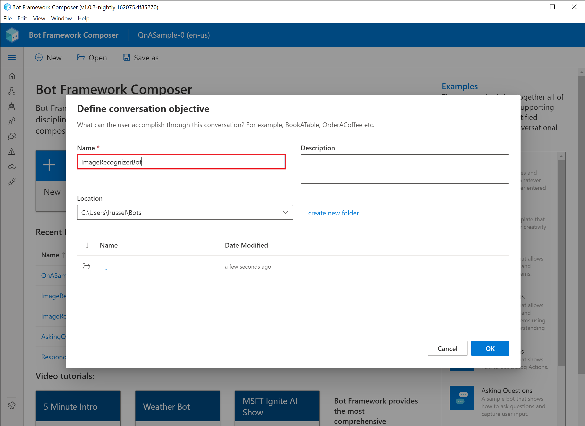
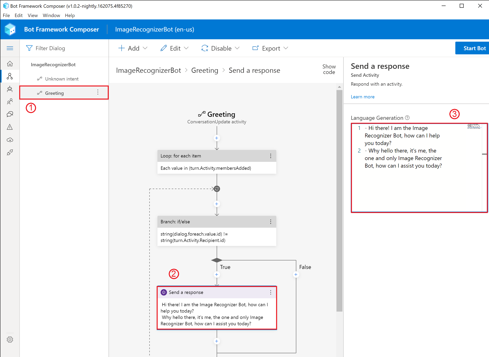
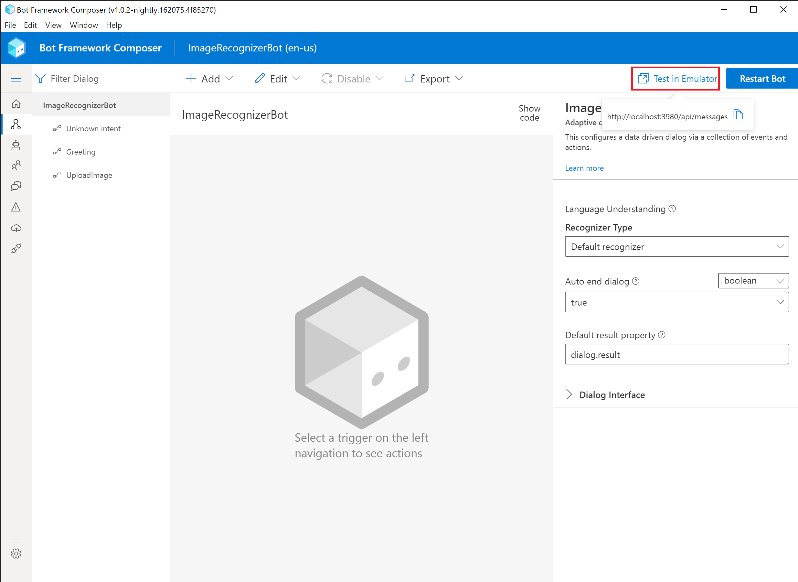
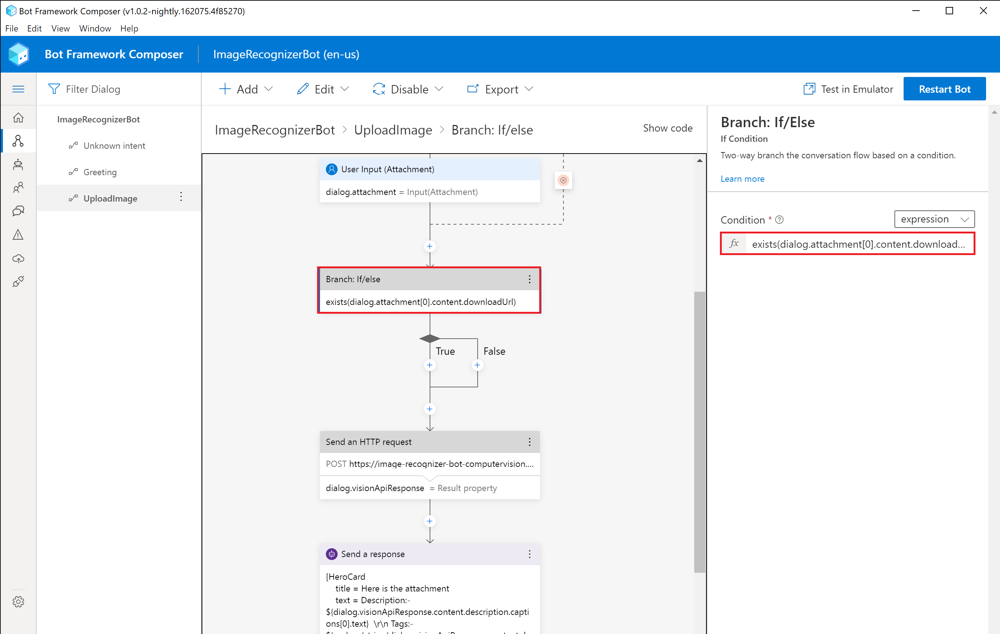
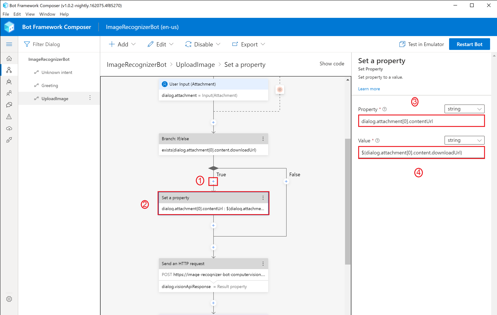
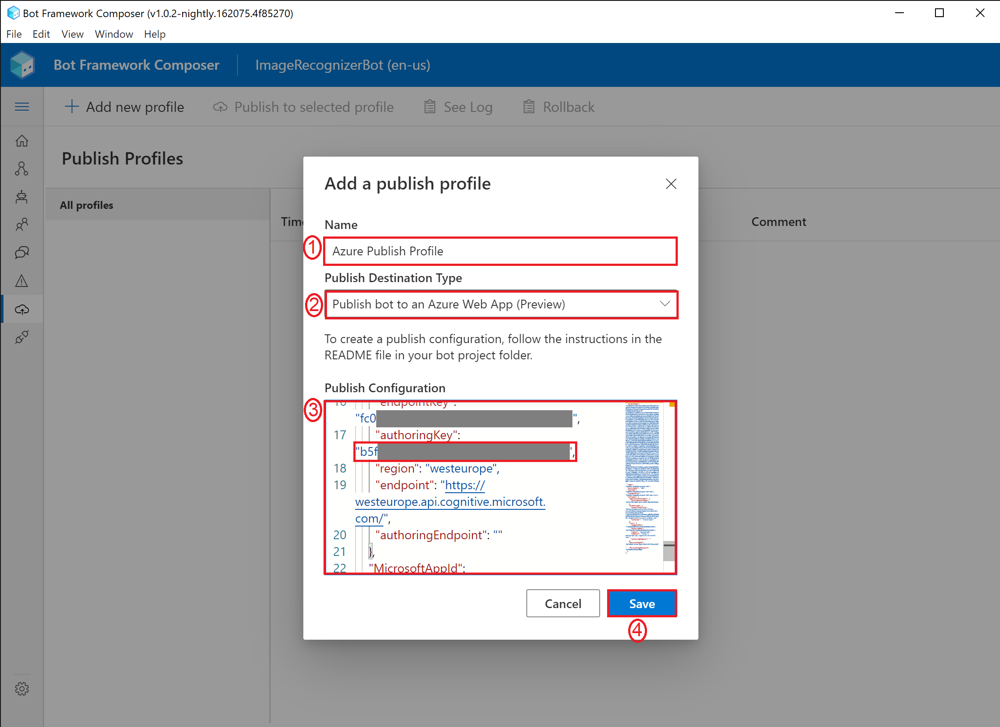
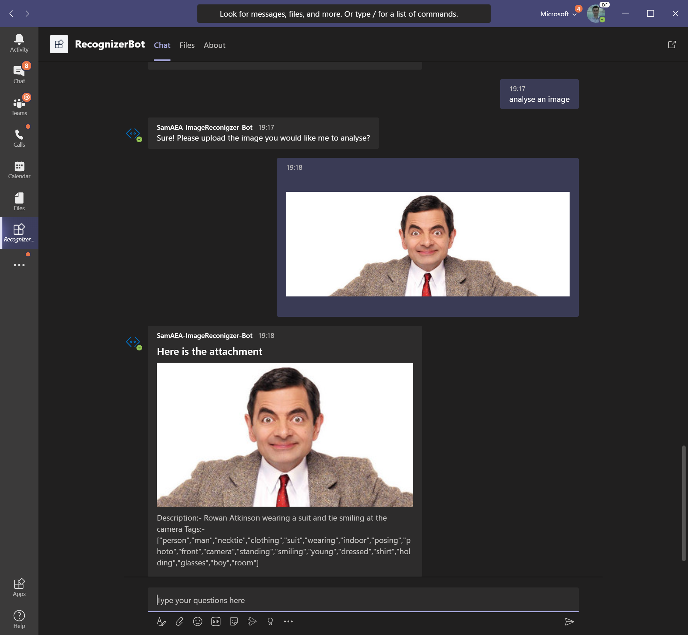

# Azure Image Recognizer Workshop
**Welcome to the one and only Image Recognizer Bot Workshop**

The following guide will help you develop step by step your own Image Recognizer bot without the need of any code experience. We will use the [Bot Framework Composer](https://docs.microsoft.com/en-us/composer/introduction), which is a open-source visual authoring canvas for developers and multidisciplinary teams to build bots. By the end of the workshop, you would have created a bot capable of receiving and describing an image of your choice using Azure AI Cognitive Services.

- **From an architectural perspective, the following Azure services are being used:**
  -  Web App
  -  Cosmos Database
  -  Storage account
  -  App Service
  -  **Azure Cognitive Services:**
      - LUIS (Language Understanding Intelligent Service)
      - Computer Vision API

## Prerequisites

> It's important to ensure all of the following prerequisites are met:-

1. An Azure subscription
1. [Bot Framework Composer v1.0.2-nightly.162075.4f85270](https://github.com/microsoft/BotFramework-Composer-Nightlies/releases/tag/v1.0.2-nightly.162075.4f85270)
1. [Bot Framework Emulator](https://github.com/Microsoft/BotFramework-Emulator/releases). 
1. [Azure CLI](https://aka.ms/installazurecliwindows)
1. [.NET Core SDK](https://dotnet.microsoft.com/download)
1. [Ngrok](https://ngrok.com/download)

      ***NOTE**:- Please take notice of the Bot Framework Composer version number and ensure that version is being used for this lab*


## Overview of the Bot Framework Composer
Bot Framework Composer is an open-source, visual authoring canvas for developers and multi-disciplinary teams to design and build conversational experiences with Language Understanding and QnA Maker, and a sophisticated composition of bot replies (Language Generation). Within this tool, you'll have everything you need to build a sophisticated conversational experience.

- A visual editing canvas for conversation flows
- In context editing for language understanding (NLU)
- Tools to train, test and manage language understanding (NLU) and QnA components
- Language generation and templating system
- A ready-to-use bot runtime executable

## Let's begin!

### 1. Building our Image Recognizer Bot locally!

  We will now begin to build out our bot locally and publish it to Azure later, when we wish to connect to our bot through channels such as Microsoft Teams.

  1. **Open** the Bot Framework Composer application by searching through it in the start menu
  
      
       
  1. Click on **New** --> **Create from Template** -> **Echo Bot** -> name your bot **ImageRecognizerBot** and click **OK**

      

      

      

  1. >You will notice it creates by default two dialogs, one called "Unknown Intent" and the other called "Greeting". "Unknown Intent" is the dialog that is run when Language Understanding is not able to determine the intent for the user. Greeting is run when a user joins a chat with the bot.

      - Select the **Greeting** dialog, click on **Send a response** and replace **-${WelcomeUser()}** with following response:-

      ```code
      - Hi there! I am the Image Recognizer Bot, how can I help you today?
      - Why hello there, it's me, the one and only Image Recognizer Bot, how can I assist you today?
      ```

      >The above demonstrates that you can greet your user with a variation of responses. Your bot will pick which one at random and display the respective response. This feature is great because it makes your bot sound less robotic compared to when it sends the exact same response each time. 


      


  1. >We will now extend our bot by adding a new intent and dialog called UploadImage. In order for our bot to detect this intent, we need to give it a few example utterances/sentences that demonstrates this intent. These utterances are then used by LUIS (Language Understanding Intelligent Service) to train the model for mapping our user's utterances with this intent.

      - Click on **+ Add** and then **Add new trigger on ImageRecognizerBot**

      - Name the dialog **UploadImage** dialog and provide the following example utterances to train LUIS


      ```code
      - I would like to upload an image
      - analyse my picture
      - describe an image
      ``` 

      
      
      

  1. >Now it's time to populate our UploadImage dialog to capture image uploads from our user,

      - Click **+** -> **Ask a question** -> **File or attachment**

      - Click on **Bot Asks (Attachment)** and paste in the following text:-

      ```code
      - Sure! Please upload the image you would like me to analyse?
      ```

      

      

  1. Click on **User Input** and name the property **dialog.attachment** and Output format as **all**
     > This basically means we can store and access the properties of our uploaded image via the variable dialog.attachment. Because we are using the property dialog to store our variable, the lifetime of our variable will persist to the same lifetime as our dialog. To learn more about memory state, please visit https://docs.microsoft.com/en-us/composer/concept-memory.

      

  1. Click on  **+** -> **Send a response** and input the following text into the Language Generation box.

      ```code
      [HeroCard
      title = Here is the photo you uploaded!
      image = ${dialog.attachment[0].contentUrl}
      ]
      ```
  
      > It is possible to send bot responses that have enriched content beyond plaintext. This is when elements like HeroCard come in handy to display content such as images. More information on different type of cards can be found here:- https://docs.microsoft.com/en-us/composer/how-to-send-cards#card-types.

      

  1. Let's configure our bot to speak with LUIS
      - Click on the **Settings cog** icon located at the bottom left of the screen.
      - In the Bot Settings JSON text box, scroll down to the **luis** section and replace **authoringKey**'s key value with the authroingKey provided by your instructor.
      - In the same LUIS section, replace **endpoint**'s key value with **https://westeurope.api.cognitive.microsoft.com**

      

  1. Time to run and test our bot works okay! 
  
      - Click on **Start Bot**
      - Click on **Test in Emulator**


      

  1. Before we ask our bot to analyse an image, we need to provide one. As such, lets download Mr.Bean's picture from Flickr (because why not :)). Click the following link which will automatically download Mr's Bean image https://live.staticflickr.com/4244/34613307720_d29cf0dd97_o_d.jpg.

  1. Ask the bot to analyse your image. Use the below transcript screenshot as an example on how to do that. When it asks to upload an image, click on the **Attachment** icon -> Browse to your **Downloads** folder and select the image you just downloaded (e.g. **34613307720_d29cf0dd97_o_d.jpg**).

      

      >Your bot should have returned a preview of the image you uploaded. This is an indication everything is working fine - well done! Next step will be to connect to Azure AI Cognitive Service to describe our image and for our bot to return the result.

1. Let's now add a step to send our uploaded images to be analysed by Azure AI Cognitive Service called Computer Vision. Before we can do this however, we will need to deploy Computer Vision via Azure.

    - Navigate to https://portal.azure.com
    - Click on **Create a new resource**
    - Search for **Computer Vision** and when the option appears in the dropdown menu, click on it.
    - Click **Create**
    - Fill out the form:-
        - **Resource group**:- select your resource group you want to deploy the bot to e.g. **labuser1000-ImageRecognizerBot**
        - **Region**:- select **North Europe**.
        - **Name**:- name your Computer Vision API e.g. labuser1000-ImageRecognizerBot-computervision
    - Click on **Review + create** and then **Create**
    - Once deployed, click on **Go to Resource**
    - Click on **Keys and Endpoint** from the left handside menu and take note of **Key 1** and the **Endpoint**.


      

      

      

      

      

      

      


  1. Switch back to Composer and click on the **+** button, the one just before the HeroCard response -> **Access External Resources** - > **Send an HTTP Request**
      - Select the **HTTP method** as **POST**
      - Set the URL to **XXXX**/vision/v2.1/analyze?visualFeatures=Description,Tags&subscription-key=**YYYY**
      - Replace **XXXX** with the Computer Vision **endpoint** and **YYYY** with the **Key 1** (obtained from the previous step). 
      - In the **Body** paste the following:-
        ```code
        {"url":"${dialog.attachment[0].contentUrl}"}
         ```
      - Under the **Result property**, input **dialog.visionApiResponse**
        > This will basically output the response of the Vision API call into that variable. More information about sending HTTP requests in Composer can be found [here](https://docs.microsoft.com/en-us/composer/how-to-send-http-request).
      
      

  1.  Let's modify the HeroCard response to reflect the results from the Computer Vision response. **Replace** its content with the following:-
      ```code
      [HeroCard
          title = Here is the attachment
          text = Description:- ${dialog.visionApiResponse.content.description.captions[0].text}  \r\n Tags:- ${replace(string(dialog.visionApiResponse.content.description.tags),'\r\n', '')}
          image = ${dialog.attachment[0].contentUrl}
       ]
       ```
       > As you can see above, we are accessing the properties of the dialog.visionApiResponse, which is the response given back when we performed the HTTP request above to the Computer Vision API. In addition, I used \r\n to generate a linebreak in the response and used the builtin replace function to remove the linebreaks from the HTTP response making it more readable.
  1. To have this solution also work with Microsoft Teams, the attachment is accessible by the variable ${dialog.attachment[0].content.downloadUrl}** instead of ${dialog.attachment[0].contentUrl}. This is due to the file being behind an authenticated link. If you're interested to know more, have a look [here](https://developer.microsoft.com/en-us/microsoft-teams/blogs/working-with-files-in-your-microsoft-teams-bot/).

      - Click on **+** -> **Create a condition** -> **Branch: If/Else**
      - In the Condition field, set it to:-
        ```code
        exists(dialog.attachment[0].content.downloadUrl)
        ```
      - Under **True** click on **+** -> **Manage properties** -> **Set a property**
      - Under the **Property** field, set it to:-
        ```code
        dialog.attachment[0].contentUrl
        ```
      
      - Under **Value** set it to:-
        ```code
        ${dialog.attachment[0].content.downloadUrl}
        ```
      

  1. Go ahead and click on **Restart the bot** and afterwards on **Test in Emulator**
      - Click on the **Settings** icon and ensure the tickbox **Bypass ngrok for local addressess** is **unticked**
      - Swith back to the **Live Chat** tab
       
      - Try asking the bot to analyse your picture again and upload the same picture. You should see a response similar to the screenshot below:-
       


### 2. Deploy our bot to Azure
  >In order to speak with our bot outside of our over channels such as Teams
  1. Find out the location of your bot by clicking on the **Home** icon and reviewing the **Location** column. E.g. C:/Users/hussel/ImageRecognizerBot

       

  1. We will also need to know the Azure Subscription Id of the subscription we will deploy our bot to:-

      - Switch back to the browser where you have the Azure Portal already logged OR navigate to https://portal.azure.com
      - In the Search Bar type in **Subscriptions** and click on **Subscriptions** from the dropdown menu
      - Find your subscription you want to use and take note of the **Subscription Id**, you will need this in the next step.

         
           

  1. Now we will open PowerShell to run Bot Framework Composer scripts to deploy your bot solution to Azure.

      - Open **PowerShell**
        
      
      - **Copy** and **paste** the following command, but replace **{LOCATION}** with the location of your bot (taken) from the previous step:-
        ```code
        cd "{LOCATION}\scripts"
        ```
        


     - Run the following command:-
        ```code
        npm install
        ```     

     - Run the following command, but replace the following values:-
       - **\<YOUR AZURE SUBSCRIPTION ID\>** with the subscription id you noted in the previous step
       - **\<NAME OF YOUR RESOURCE GROUP\>** with a **globally unique** name. For example, your **youralias-ImageRecognizerBot**
       - **\<APP PASSWORD\>** with a password that is at least 16 characters long with at least one number, one letter, and one special character. You can use your own password or even an online password generator such as https://www.random.org/passwords/
          ```code
          node provisionComposer.js --subscriptionId=<YOUR AZURE SUBSCRIPTION ID> --name=<NAME OF YOUR RESOURCE GROUP>--appPassword=<APP PASSWORD> --environment=dev --createLuisAuthoringResource false --location westeurope--createCosmosDb false
          ```
        
       - Assuming you have the same outcome as the above screenshot, you will be asked to navigate to **https://microsoft.com/devicelogin** and enter the code provided to authenticate into Azure. Please do this and select the correct account.

        
        
        

       - **Switch back to PowerShell** upon successful authentication. You should notice everything is now deploying to Azure. When it finishes, it will output a JSON file which we will use in Bot Framework Composer. **Copy the output from the terminal** somewhere like Notepad, everything from the first open bracket until the last bracket, **for example**:-
       ```code
       {
        "accessToken": "XXXX",
        "name": "XXXX",
        "environment": "dev",
        "settings": {
          "applicationInsights": {
            "InstrumentationKey": "XXXX-XXXX-XXXX-XXXX-XXXX"
          },
          "cosmosDb": {
            "cosmosDBEndpoint": "XXXX",
            "authKey": "XXXX",
            "databaseId": "XXXX",
            "collectionId": "XXXX",
            "containerId": "XXXX"
          },
          "blobStorage": {
            "connectionString": "XXXX",
            "container": "XXXX"
          },
          "luis": {
            "authoringKey": "XXXX",
            "authoringEndpoint": "",
            "endpointKey": "XXXX",
            "endpoint": "https://westeurope.api.cognitive.microsoft.com/",
            "region": "westeurope"
          },
          "MicrosoftAppId": "XXXX-XXXX-XXXX-XXXX-XXXX",
          "MicrosoftAppPassword": "XXXXXX"
        },
        "hostname": "XXXX-ImageReconigzer-Bot-dev",
        "luisResource": "XXXX-ImageReconigzer-Bot-dev-luis"
       }
       ```
        

       >Congratulations - all the required Azure Services have now been deployed! We also have the required connection strings that we can use to feed to Composer in order to deploy our bot to Azure

  1. **Swith back to Composer**

      - Click on the **Publish** icon and then on **Add a new Profile**
      
        
      - For the **Name** give it any name e.g. **Azure Publish Profile**
      - For the **Publish Destination** select **Publish bot to an Azure Web App (Preview)**
      - **Paste** the JSON output from the previous step into the **Publish Configuration** field
      - Locate the **authoringKey** key in **Publish Configuration** and insert your **LUIS authoring** key in between the two qoutations.
      - Click **Save**
              
      - Click on **Publish to select profile**
      - After a couple of minutes, you should receive **Success**
                
      >Congrats! You've now deployed your bot to Azure, which means you can access it from anywhere in the world! 
  1. **Switch to the web browser that has Azure Portal** already loaded OR navigate to https://portal.azure.com.
      - Click on **Resource Groups**
      - Select your resource group (e.g. **SamAEA-ImageRecognizerBot**)
      > You should now be able to see all the Azure services deployed by the PowerShell script we ran earlier.
      - Select your bot resource
      - Click on **Test in Webchat**
        
      - Feel free to chat with it like you did locally!
      
### 3. Enablement of Teams Channel

We will now activate the Teams Channel so that you can communicate via text messaging with your Image Recognizer Bot via Teams. 

   1. Enable our bot to be surfaced through Microsoft Teams
      - In the same browser tab we had opened in the previous step, click on **Channels**
      - Click on the **Teams** icon
       
      - "Terms of Service" window may appear. If so, click on **Check the box and click ok**
       

      - Click on the **Save** button

       

   1. Time to create a Teams manifest file to install our bot into Teams. If you're interested to find out more information, you can find this [here](https://docs.microsoft.com/en-us/microsoftteams/platform/bots/how-to/create-a-bot-for-teams#create-your-app-manifest-and-package)

      - **Download** a premade Teams manifest ZIP file by clicking [here](https://github.com/samaea/Image-Recognizer-Bot-Workshop/releases/download/0.1/RecognizerBot.zip)
      - **Open File Explorer** and go to your **Downloads** folder. 
      - **Right click** on the **RecognizerBot.zip** and click on **Extract All...**
       
      - Click on **Extract**
       
      - Open the **manifest.json**
       
      - Replace the **two** values of **b67388d7-e144-4ae2-9394-9273f56c4265** with your bot ID. This can be found from the JSON outputted in the PowerShell terminal in the previous steps. It will be called **MicrosoftAppId**
       
      - **Save** the notepad file
      - **Switch back** to the **File Explorer** and **highlight all the three files** in the folder, **right click** using your mouse and select **Send To** -> **Compressed (zipped) folder**
       
      > This will save a file called manifest.zip in that same folder which we will use in the next step.
   1. Open **Teams**
      - Click on the **Ellipsis (...)**
      - Click on **More apps**
      - Click on Upload a custom app
       
      - Browse to **Downloads** -> **RecognizerBot folder** and select the **manifest.zip** you created in the previous step
             
      - Click on **Add for me**
      
      - The bot should now appear in Teams and you will now be able to analyse images in Teams, whether that's over the Desktop app or even Mobile app!
      

         
### 4 Final Wrap Up

You have successfully created your own Image Analyser Bot, congrats! This guide will stay publicly available, so if you wish to create a demo for internal or external meetings, you can do so by performing the steps within your Azure Subscription since the Lab Service will be shut down after MS Ready to avoide costs. 

Worth mentioning: developing a chatbot like you just did within an hour or so, would not be possible with the Azure PaaS Services and templates we were using. This is a huge benefit for the application development teams and accelerate pilots and new projects.
